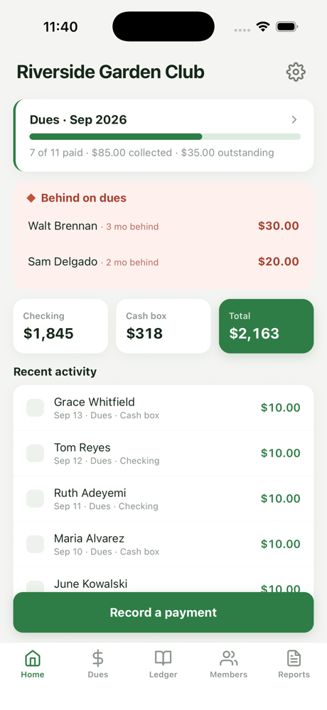
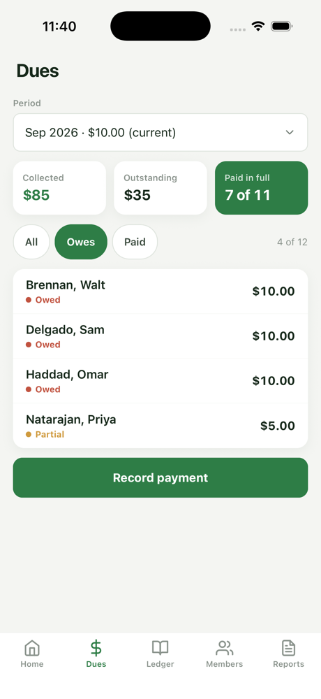
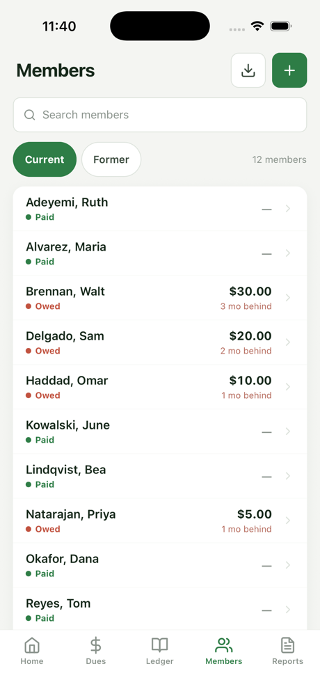
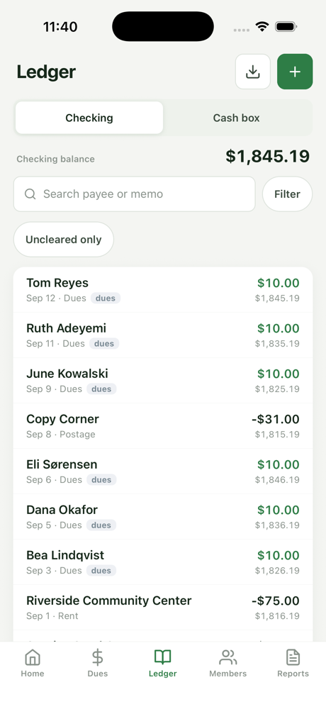
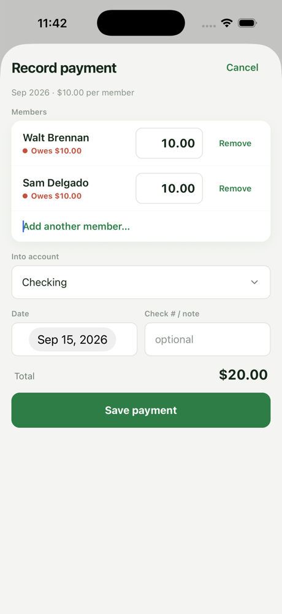
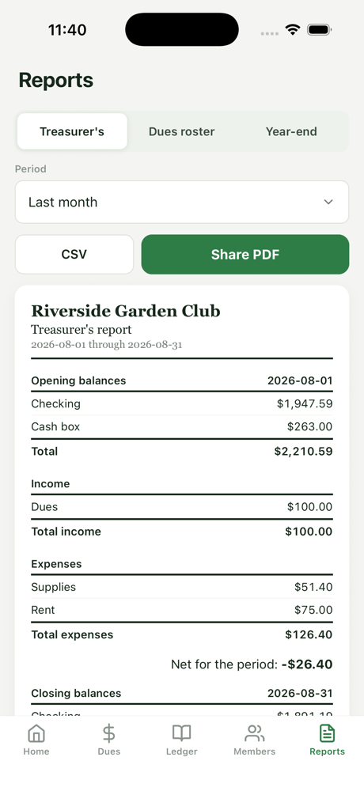

# Duesbook

**Your organization's books, on your phone.**

Duesbook is an app for treasurers of small organizations: clubs, lodges,
PTAs, HOAs, congregations. It keeps your accounts, members, and dues in one
place, and it keeps them **on your phone**: no accounts, no cloud, no
subscription, and no data sent anywhere.

It is built for the two jobs a treasurer actually has. Once a month at the
desk, with the bank statement open: import, categorize, reconcile, run the
report. And at the meeting, with the phone in hand: see who owes, record the
dues handed over, show the numbers.

## What it does

- **Home** — every balance, this period's dues progress, and who has fallen
  behind, on one screen.
- **Dues** — monthly or yearly billing, one amount for everyone with
  per-member waivers and prorating. Recording a payment is one sheet: pick
  the member (or several; one check can cover two memberships), the amounts
  prefill with what is owed, save. New periods create themselves as months
  roll over.
- **Members** — the roster with each person's dues position at a glance and
  their full history one tap away. Tap to call, text, or email. Add people by
  hand, from your Contacts, or from a spreadsheet.
- **Ledger** — a checkbook-style register per account (checking, savings,
  cash box) with categories, transfers, a running balance, and a cleared
  checkbox for reconciling against the statement.
- **Bank import** — bring in the CSV, Excel, or OFX/QFX file your bank's app
  or site gives you. Imports are reconciliation-aware: re-importing a file,
  or importing something you already typed in, never counts money twice.
  Duesbook never connects to your bank.
- **Reports** — a treasurer's report for the meeting, a dues roster, and a
  year-end summary. Read them on the phone, share them as PDF, or export CSV
  for a spreadsheet.
- **Backups and handoff** — a timestamped snapshot of the books each day you
  use the app, visible in the Files app, plus save-a-copy anywhere Files can
  reach. When the term ends, one tap makes a handoff file; the next treasurer
  opens it on their phone and the books carry on.
- **App lock** — optionally require Face ID, Touch ID, or the passcode
  whenever Duesbook comes to the front.

Members paying dues through Venmo or PayPal? See
[Receiving dues through payment apps](docs/venmo-paypal-dues.md).

## What it looks like

| | | |
|---|---|---|
|  |  |  |
|  |  |  |

## The privacy promise

Duesbook makes **no network requests**. None. There is no update check
(updates come through the app store), no analytics, no crash reporting, and
no sync. The only ways anything leaves the phone are the ones you trigger
yourself: sharing a report, saving a copy of the books, or making a handoff
file.

Picking a member from Contacts uses the system picker, which hands Duesbook
only the one card you chose; the app never asks for access to your whole
address book. Don't take our word for it: this repository is the entire app.

## Get it

Duesbook is in TestFlight ahead of its App Store release for iPhone and
iPad. An Android version is planned from the same code. Store links will
appear here when they exist.

## Moving from the desktop app

Duesbook 1.x was a desktop app for Mac and Windows. It is frozen at
[v1.3.0](https://github.com/pshelton-dev/duesbook/releases/tag/v1.3.0) and
still works, but all new work is on the phone. Your books move over in one
step:

1. On the desktop app, open **Settings**, find **Treasurer handoff**, and
   click **Export for new treasurer**. The folder it writes contains a
   `.db` file named after your organization.
2. Get that file onto the phone any way you like: AirDrop, the Files app,
   or email it to yourself.
3. Tap the file. Duesbook opens and offers to restore it. The schema is
   identical, so nothing is converted and nothing is lost.

## Building from source

```bash
npm install
npm run ios          # native build onto the iOS simulator or a device
npm run test:data    # the data layer, on Node's built-in SQLite
npm run seed:demo -- path/to/duesbook.db   # a fictional club's books, for screenshots
```

Requires Node 24+, Xcode, and CocoaPods. There is no cloud build step; the
TestFlight release process is a local script, described in
[docs/release-ios.md](docs/release-ios.md).

## Tech

Expo + React Native + TypeScript, with all data in a single SQLite file
(expo-sqlite) inside the app's own container. The schema is shared with the
desktop app byte for byte; see `DATA-MODEL.md` for it and the reasoning
behind it, `REQUIREMENTS.md` for the project's decisions, and
`SCREEN-MAP.md` for the screens.

## License

Duesbook is source-available under the
[PolyForm Noncommercial License 1.0.0](LICENSE). You can read it, build it,
change it, and run it for any noncommercial purpose; the paid app in the
stores is the only commercial distribution.

Versions through 1.3.0 (the desktop app, kept on the `desktop-final` branch
and its tags) were released under the MIT license and remain so.
