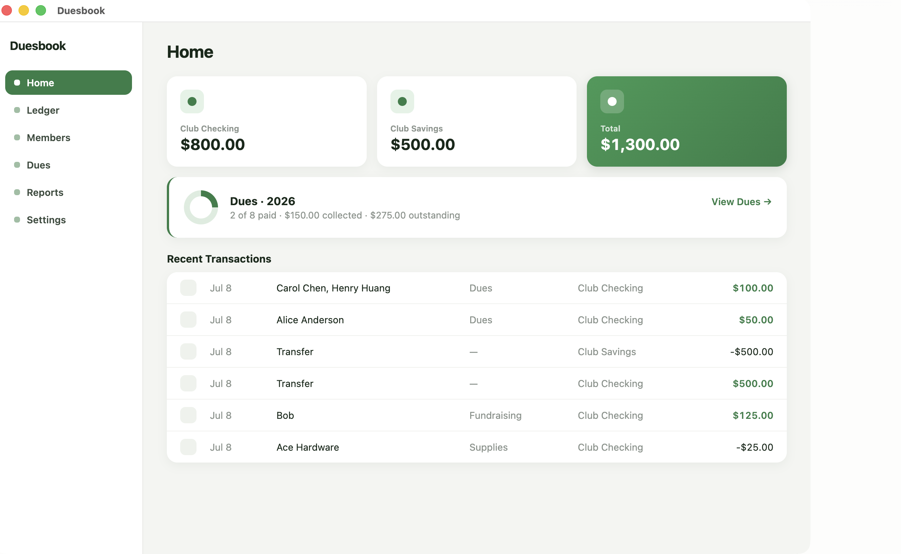
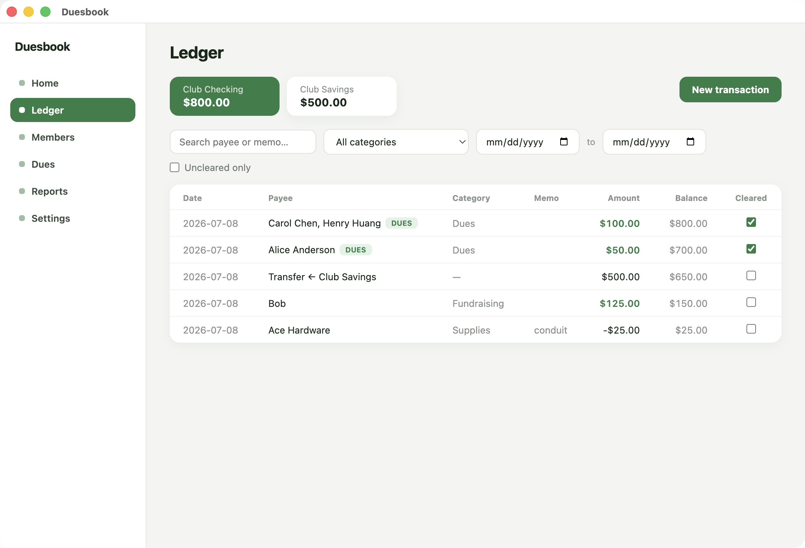
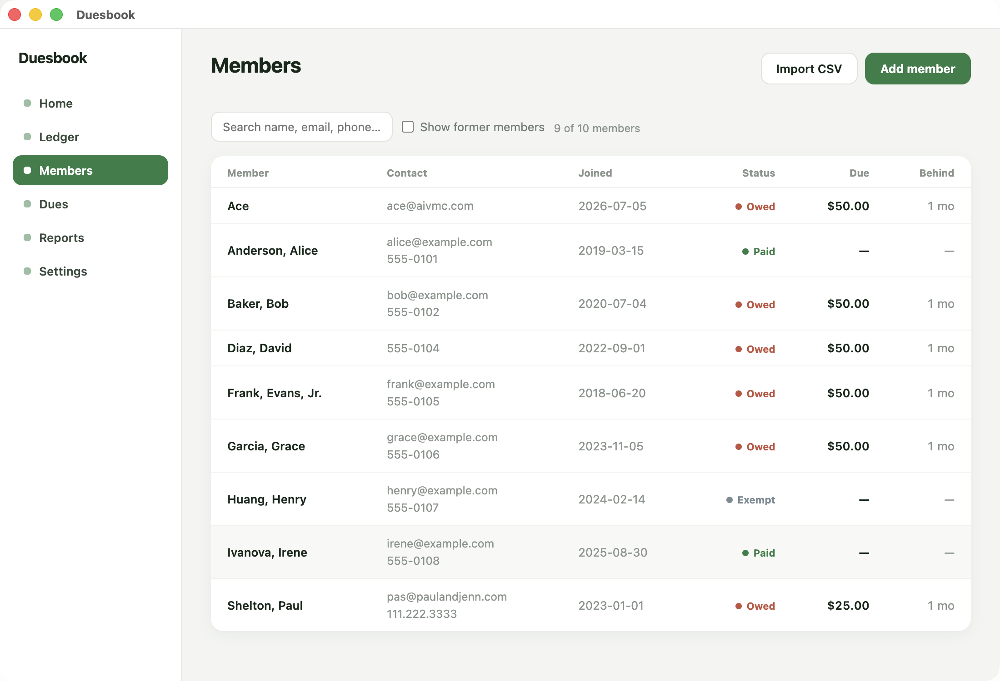
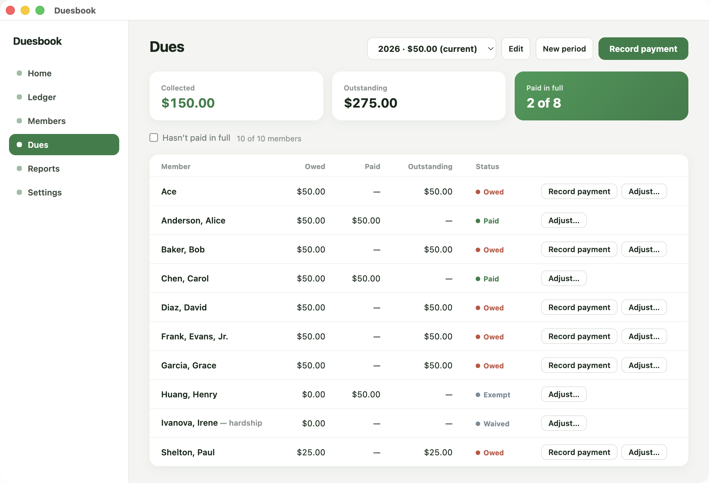
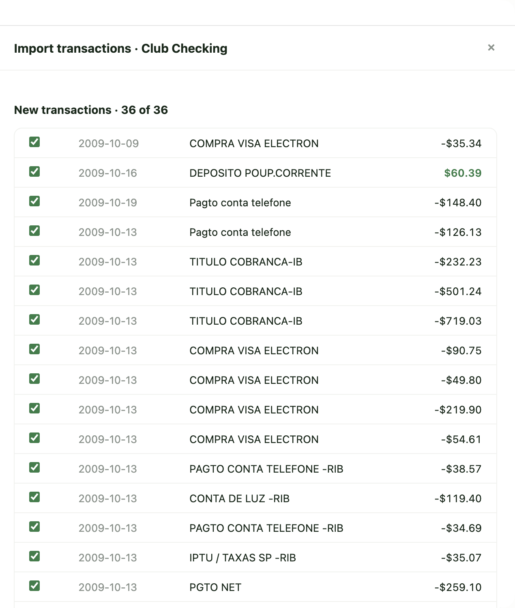

# Duesbook

**Your organization's books, on your machine.**

Duesbook is a free desktop app for treasurers of small organizations — clubs,
lodges, PTAs, HOAs, congregations. It keeps your accounts, members, and dues
in one place, and it keeps them **on your computer**: no accounts, no cloud,
no subscription, and no data sent anywhere.

## What it does

- **Ledger** — a checkbook-style register for each account (checking,
  savings, cash box) with categories, transfers, filters, and a running
  balance. Tick transactions off against your bank statement.
- **Bank import** — pull transactions straight from a file your bank gives
  you (CSV, Excel, or OFX/QFX). Imports are reconciliation-aware: re-importing
  a file, or importing something you already typed in by hand, never counts
  money twice. Duesbook never connects to your bank — you download the file
  yourself, and it never leaves your computer.
- **Members** — the roster, with each member's total dues position at a
  glance and their full payment history one click away. Import your existing
  list from a CSV.
- **Dues** — monthly or annual billing. Recording a payment takes one dialog:
  pick the member (or several — one check can cover two memberships), amounts
  prefill with what's owed, save. Waivers and prorated amounts are per-member.
  New periods create themselves as months roll over, and members who fall
  behind are flagged on the home screen.
- **Reports** — a treasurer's report for meetings, a dues-status roster, and
  a year-end summary. Print them (or save as PDF from the print dialog), or
  export CSV for a spreadsheet.
- **Backups & handoff** — automatic timestamped backups to a folder you
  choose, one-click restore, and an "export for new treasurer" package with
  plain-language instructions, because treasurers change and the books must
  outlive the laptop.

Members paying dues through Venmo or PayPal? See
[Receiving dues through payment apps](docs/venmo-paypal-dues.md).

## What it looks like

| | |
|---|---|
|  |  |
|  |  |

<p align="center"></p>

## The privacy promise

Under normal operation Duesbook makes **zero network requests**. The one
exception is an optional, on-by-default update check that fetches only the
latest version number from GitHub — it sends nothing about you or your
organization, and you can turn it off in Settings. Don't take our word for
it: this repository is the entire app.

## Install

Download the latest release from the
[releases page](https://github.com/pshelton-dev/duesbook/releases).

Current builds are **not yet code-signed** (signing is planned), so both
operating systems warn you the first time. That's them saying "we don't know
this developer" — not that something is wrong. The exact steps:

**macOS**

1. Download `Duesbook-<version>-arm64.dmg` (Apple Silicon Macs).
2. Open the DMG and drag **Duesbook** into **Applications**.
3. First launch only: **right-click** Duesbook in Applications and choose
   **Open**. If macOS still refuses, open **System Settings → Privacy &
   Security**, scroll to the note about Duesbook, click **Open Anyway**, and
   launch it again.

**Windows**

1. Download and run `Duesbook-Setup-<version>-x64.exe`.
2. On the blue **"Windows protected your PC"** screen, click **More info**,
   then **Run anyway**.

**Why trust an unsigned app?** Don't take our word for it: this repository is
the entire application, and each release's installers are built from it in
public by GitHub Actions. If you'd rather not run a prebuilt binary at all,
build it yourself below.

## Building from source

```bash
npm install
npm run dev      # run in development
npm run dist     # build an installer for your platform
```

Requires Node 24+. Windows installers are built by CI on Windows runners
(native modules don't cross-compile).

## Tech

Electron + TypeScript + React, with all data in a single SQLite file
(better-sqlite3) under your OS user profile. See `DATA-MODEL.md` for the
schema and the reasoning behind it, and `REQUIREMENTS.md` for the project's
design decisions.

## License

[MIT](LICENSE)
