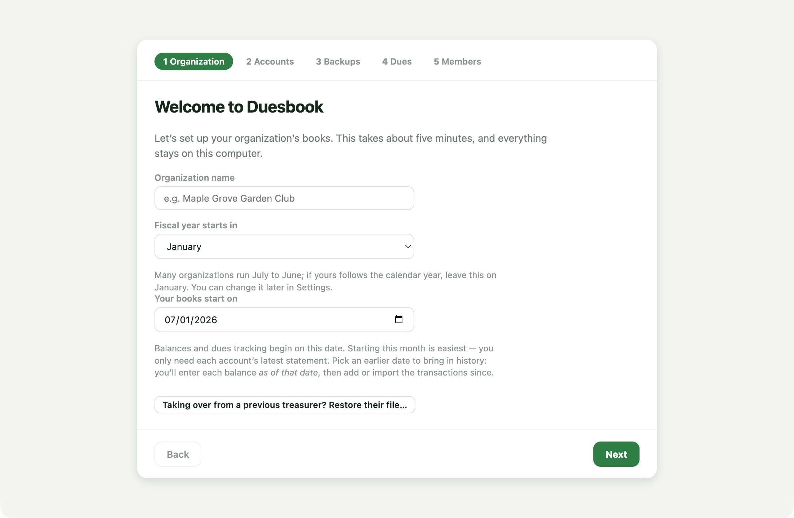
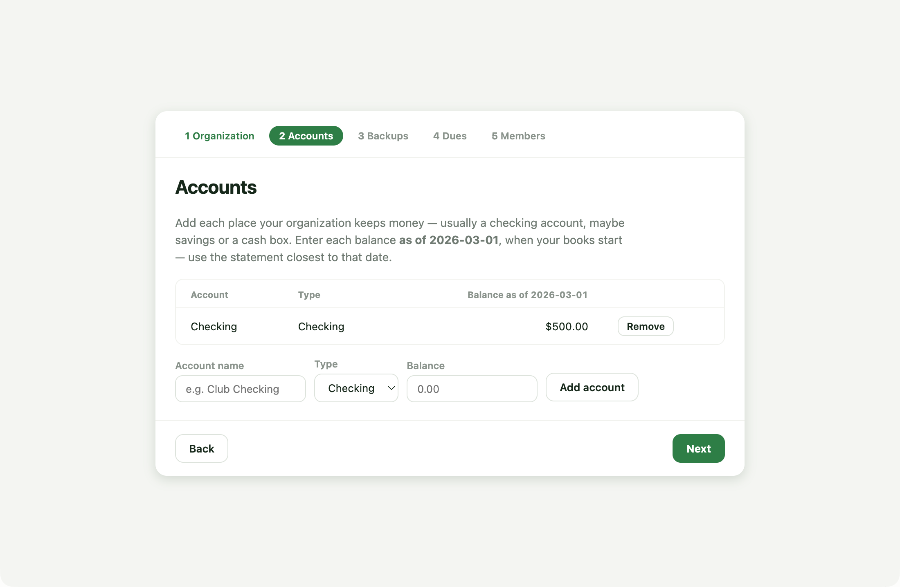
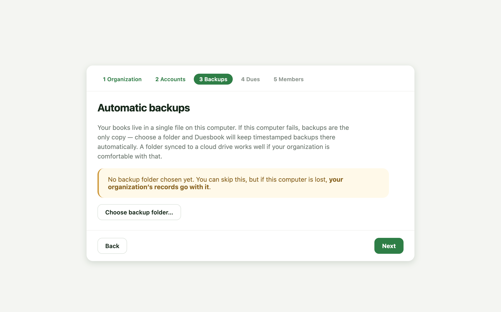
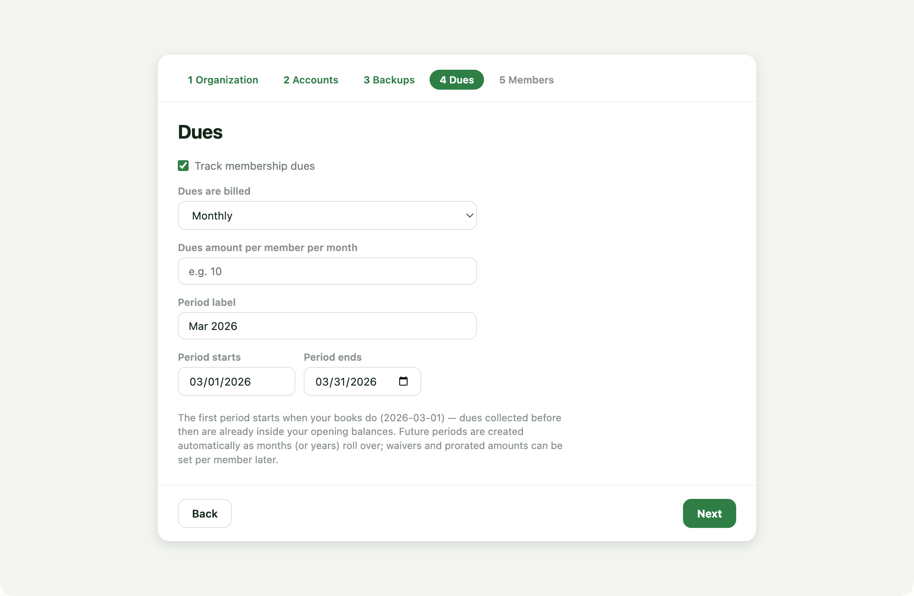
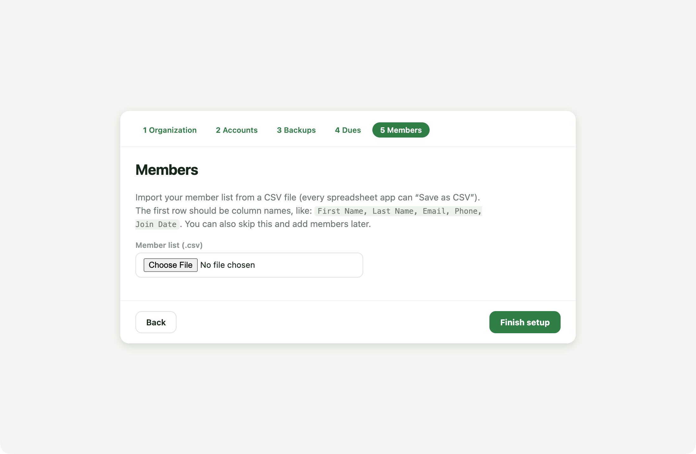
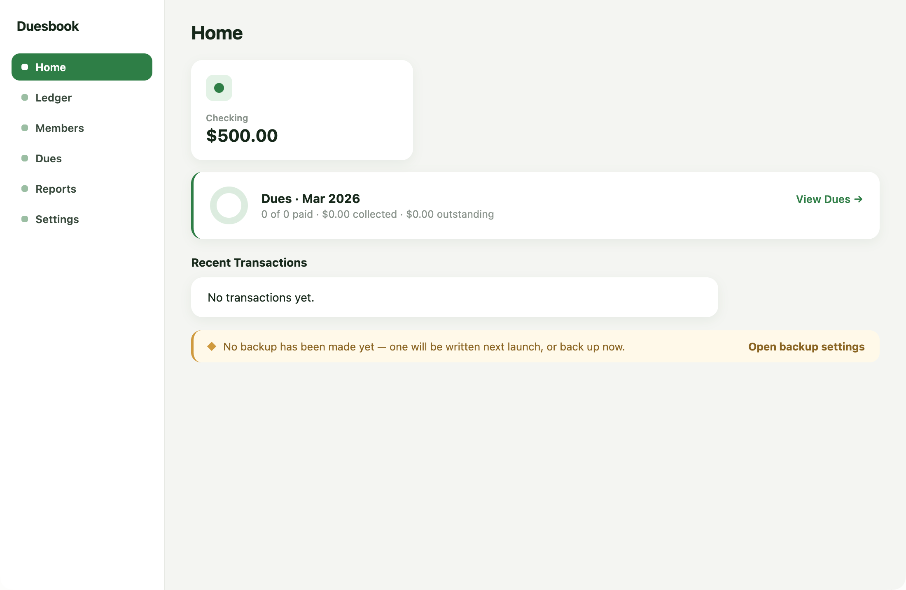

# Getting started with Duesbook

Five minutes from install to working books. Install first (see the
[README](../README.md#install) for the unsigned-build steps on your OS), then
launch Duesbook — it opens straight into setup.

## 1 · Your organization

Name the organization, set the fiscal year, and pick **when your books start**.

The books-start date is the important choice. **Starting this month** is
easiest — you only need each account's latest statement. **Pick an earlier
date** if you want history in Duesbook: you'll enter each account's balance
*as of that date* and then add or import the transactions since. (The
screenshots below show books starting March 1.)

Taking over from a previous treasurer who used Duesbook? Skip everything and
use **Restore their file…** instead.

## 2 · Accounts

Add each place the organization keeps money. The balance you enter is the
statement balance **as of your books-start date** — Duesbook pins the date so
the books can't contradict themselves.

## 3 · Backups

Your books live in one file on this computer. Choose a folder — ideally one
synced somewhere safe (Synology, Dropbox, a USB drive you actually plug in) —
and Duesbook keeps timestamped backups there automatically.

You can skip this, but the warning means it: no backups, no insurance.

## 4 · Dues

Choose monthly or yearly billing and the amount. The first period starts when
your books do — dues collected before then are already inside your opening
balances. New periods create themselves as time passes.

## 5 · Members

Import your roster from a CSV (any spreadsheet can "Save as CSV") with a
column-mapping preview, or skip and add members later.

## You're in

Home shows the state of the books at a glance — balances, dues progress, and
anything that needs attention (like that backup you skipped).

### Good first moves

- **Record a dues payment** — Dues → Record payment. Pick the member, the
  amount prefills, save. Under thirty seconds.
- **Bring in bank history** — Ledger → Import… with a CSV/Excel/OFX file from
  your bank's website. Everything is previewed before it touches the books,
  and re-imports never double-count.
- **Members paying by Venmo/PayPal?** See
  [Receiving dues through payment apps](venmo-paypal-dues.md).
- **Month-end** — tick transactions against the statement (Ledger →
  "Uncleared only"), then print the treasurer's report from Reports.
